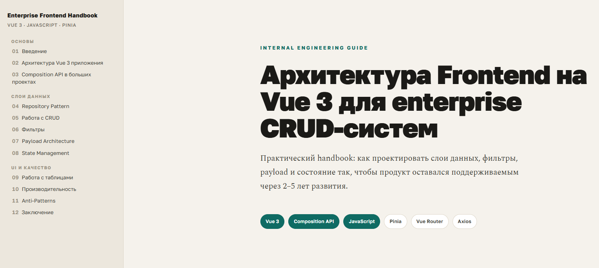

# Enterprise Frontend Handbook: Vue 3

Практичний інженерний гайд по архітектурі frontend-додатків на Vue 3 для enterprise CRUD-систем.

Створений на основі власного досвіду розробки CRM та admin-панелей, доповнений глибоким опрацюванням тем з допомогою AI.

## Що всередині

- Архітектура проекту — шари, залежності, naming conventions
- Composition API — composables, useCrudList, useFilters, usePagination
- Repository Pattern — axios, interceptors, DTO mapping, auth refresh
- CRUD — optimistic/pessimistic updates, useEntityForm, інвалідація кешу
- Фільтри — state/URL-driven, debounce, race conditions, серіалізація
- Payload Architecture — buildPayload, трансформації, normalization
- State Management — Pinia, domain/UI/entity stores
- Таблиці — BaseTable, virtual scrolling, batch actions
- Продуктивність — v-memo, shallowRef, code splitting
- Anti-Patterns — каталог з прикладами та виправленнями

Рівень: **Middle+ / Senior**

## Читати онлайн

[evgeniinalivayko.github.io/frontend-architecture-vue3](https://evgeniinalivayko.github.io/frontend-architecture-vue3/)
